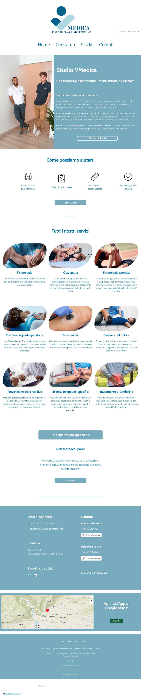
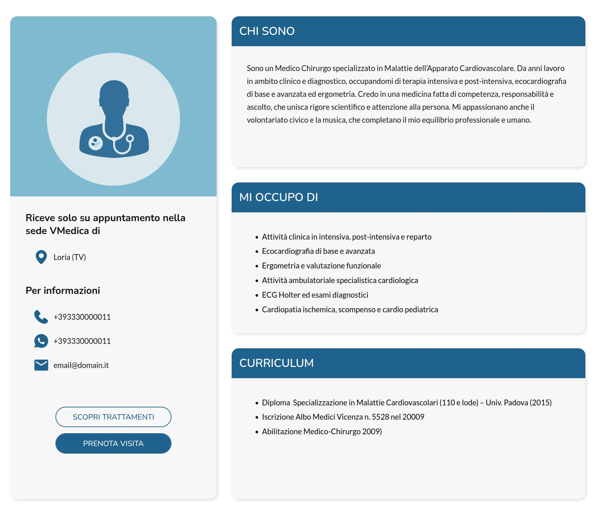
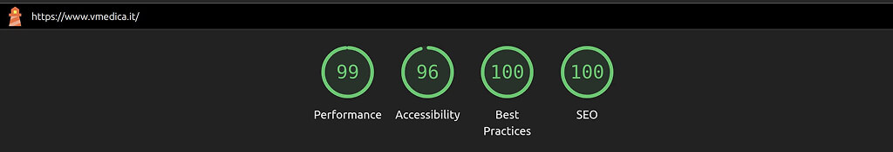
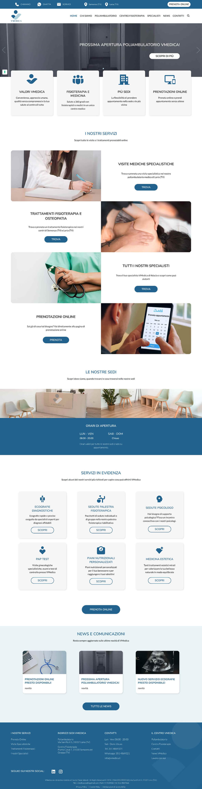

# VMedica — Real-World Website Redesign & Custom WordPress Theme

## Overview
VMedica is a local physiotherapy center that, after two years of activity, started expanding into a multi-service medical clinic (polyclinic), with new services, a new location, and online appointment booking.
The website is designed for a local Italian audience and is intentionally monolingual, prioritizing clarity, accessibility, and ease of use over internationalization.

This project involved the **full redesign and redevelopment** of the existing website, focusing on **clarity, accessibility, performance, scalability, and conversion**.

> **Note:**  
> The source code is not publicly available due to client ownership and security reasons.  
> This repository documents the **decision-making process, architecture, and outcomes** of a real-world project.

---

## Initial Situation (Before)

At the start of the project, VMedica had:
- A small, locally known physiotherapy studio
- A basic, low-budget website
- Poor performance and accessibility
- Minimal SEO optimization
- Low visibility and low conversion rate
- A static “showcase” website with no long-term maintenance strategy

The existing website was not aligned with the business evolution and was limiting future growth.

---

## Project Goals

The new website needed to support a **business transition**, not just a visual refresh.

Key objectives:
- Present VMedica as a **medical clinic / polyclinic**, not only a physiotherapy studio
- Promote:
  - a new physical location (opening soon)
  - an expanded set of medical and physiotherapy services
  - online appointment booking via a third-party management platform
- Serve a **local, non-technical audience**, including elderly users
- Be **clear, accessible, and conversion-oriented**
- Minimize UX noise and unnecessary features
- Be modular, scalable, and easy to maintain
- Comply with **EU accessibility requirements** (European Accessibility Act)
- Achieve high performance and long-term maintainability
- Improve SEO visibility and organic traffic
- Reduce dependency on third-party plugins

---

## UX & Accessibility Considerations

### Target users:
- Local patients
- Mixed demographic range
- Users often unfamiliar with complex websites or digital services

### Design and UX priorities:
- Simple and predictable navigation
- Clear service categorization
- High-contrast, readable typography
- Straightforward calls to action
- Fast access to booking and contact information
- Accessibility-first approach (semantic structure, readability, consistent interactions)

The website was designed to be **informative first and persuasive second**, avoiding unnecessary cognitive load.

### Search as a User Insight Tool
The internal search feature was not originally requested by the client.

It was proposed as a strategic addition to:
- Help users quickly find medical services
- Reduce friction for non-technical users
- Collect insights on what users actively search for on the website

Internal search data can be used over time to:
- Identify missing or unclear content
- Prioritize new services or pages
- Align website structure with real user needs

This approach allows the website to function not only as a presentation tool, but also as a lightweight source of user-driven insights, alongside more focused analytics tools such as Google Analytics and Google Tag Manager.

---

## Key Challenges & Constraints

- Creating a new visual identity while maintaining continuity with the existing brand
- Guiding a client with unclear or overly “wow-driven” ideas toward sustainable solutions
- Balancing ambition with:
  - time constraints
  - budget limitations
  - long-term maintenance effort
- Designing a UX aligned with business goals rather than trends
- Selecting a technical stack suitable for:
  - non-technical staff
  - performance requirements
  - future scalability
- Partial availability of images and copy provided by the client

---

## Technical & Architectural Decisions

### Platform Choice
- WordPress with a fully custom theme
- Figma for the creation of UI, UX and other grapichal assets

**Reasons:**
- Mature and widely supported platform
- Full control over design and architecture
- Custom content modeling (CPTs and taxonomies)
- Advanced content management via ACF
- Minimal plugin dependency
- Strong SEO capabilities
- Flexible hosting and future migration options

### Animations & Interactions

Animations were intentionally limited and used only where they supported usability and content discovery.

For interactive sections such as carousels and highlighted services on the homepage, **Swiper.js** was selected due to its:
- Reliability and long-term maintenance
- Easy integration with a custom WordPress theme
- Touch-friendly horizontal scrolling
- Low performance overhead

The goal was to enhance clarity and navigation without introducing unnecessary complexity or accessibility issues.

### Layout & Information Structure

Some sections were designed using a “soft bento-style” layout to present information in a structured, readable, and responsive-friendly way.

This approach helped to:
- Group related information into clearly defined blocks
- Improve visual hierarchy and scanning for non-technical users
- Ensure predictable behavior across different screen sizes
- Maintain flexibility as content grows over time

The layout system was intentionally kept simple and consistent, prioritizing clarity and usability over visual experimentation.

---

## Data Architecture & Content Modeling

A custom data architecture was designed to reflect the real structure of the medical clinic:

- Doctors
- Medical specialties
- Physiotherapy treatments
- Clinics / rooms
- Physical locations
- Blog and informational content

Key principles:
- Centralized data management
- No content duplication
- Dynamic associations (e.g. doctors ↔ specialties ↔ clinics)
- Reusable content blocks
- Easy updates from the dashboard without touching code

This approach reduced:
- human error
- maintenance overhead
- long-term technical debt

---
## SEO, Performance & Maintainability

This project was designed with long-term sustainability in mind, balancing visibility, speed, and ease of maintenance.

### SEO
- SEO-oriented information architecture
- Clear content hierarchy aligned with user intent
- Scalable structure for future services and locations

### Performance

- Optimized media handling with custom image sizes
- Self-hosted fonts to reduce external dependencies
- Clean, semantic markup
- Reduced frontend overhead and limited third-party scripts
- Stable layout to avoid cumulative layout shifts

Lighthouse audits were used as a validation tool rather than a strict target.

### Maintainability
- Minimal plugin dependency
- Centralized content management via custom data structures
- Predictable and scalable template architecture
- Solid foundation for future growth and content expansion

Analytics and tracking were implemented with a consent-aware approach using Google Analytics and Google Tag Manager.

---

## Outcome (After)

The final result is a scalable, high-performance website aligned with the clinic’s business growth:

- Clear presentation of services and locations
- Improved usability for non-technical users
- Strong foundation for SEO and organic visibility
- Reduced reliance on plugins
- Maintainable system usable by internal staff
- Designed to add new offices in the future without requiring major backend upgrades 

**Live website:** [https://vmedica.it]

---

## Reflections & Future Improvements

With additional time or scope, possible next steps would include:
- Extended accessibility audits and testing
- Further automation of content validation
- More advanced conversion tracking
- Improved content strategy and structured data
- New pages when new services or offices will be made available/open. 

